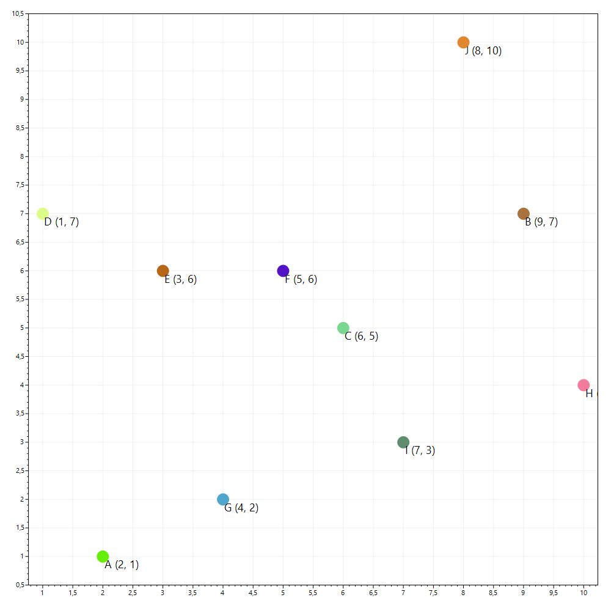
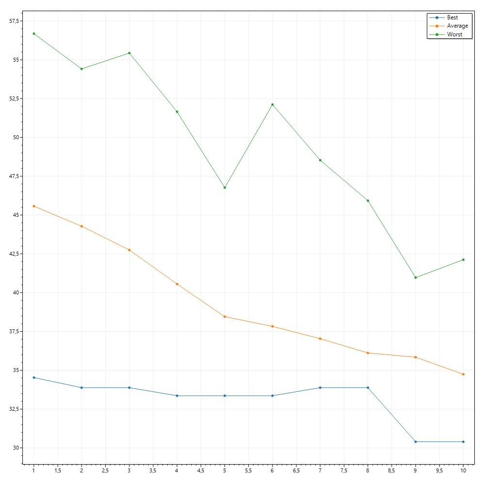

# Treść zadania

Napisać  program  rozwiązujący  problem  komiwojażera  (minimalizacja  drogi  pomiędzy  n 
miastami  bez  powtórzeń)  przy  pomocy  algorytmu  genetycznego.  Zastosować  reprodukcję 
przy użyciu nieproporcjonalnej ruletki, operator krzyżowania CX, oraz mutację równomierną. 

Program  powinien  umożliwiać  użycie  różnych  wielkości  populacji,  liczby  iteracji, 
prawdopodobieństwa mutacji.  
 
Program  powinien  zapewnić  wizualizację  wyników  w  postaci  wykresów  średniego, 
maksymalnego i minimalnego przystosowania (długości trasy) dla kolejnych populacji oraz 2 
map  (o  wymiarach  10x10  punktów),  na  których  będą  wyświetlane  miasta  oraz  drogi 
najdłuższa i najkrótsza. 
 
Pokazać działanie programu na danych testowych składających się z 10 miast, opisanych za 
pomocą współrzędnych na mapie o wymiarach 10x10 punktów. 
 
Dane testowe: miasta: 
A(2,1), B(9,7), C(6,5), D(1,7), E(3,6), F(5,6), G(4,2), H(10, 4), I(7,3), J(8,10) 

# Informacje ogólne

Program Genetic Algorithm implementuje algorytm genetyczny, który umożliwia znalezienie najkrótszej drogi prowadzącej przez wszystkie miasta tak, aby każde z nich było odwiedzone tylko raz.

### Genetic Algorithm implementuje takie operacje jak:
- reprodukcja z użyciem nieproporcjonalnej ruletki
- krzyżowanie CX
- mutacja równomierna

### Użytkownik ma wpływ na:
- rozmiar populacji
- parametry krzyżowania
- parametry mutacji
- lokalizacje, nazwy i liczbę miast

### Wynik działania programu jest na bieżąco wizualizowany za pomocą wykresów:
- średniego przystosowania
- maksymalnego przystosowania
- minimalnego przystosowania
- wizualizacji mapy miast za pomocą wykresu punktowego

## Reprodukcja
1. Na podstwie funkcji przystosowania obliczane jest przystosowanie każdego osobnika. *Prawdopodobieństwo wyboru* danego osobnika do reprodukcji obliczane jest poprzez podzielenie wartości funkcji przystosowania przez sumę wartości funkcji przystosowania wszystkich elementów populacji.
2. Operacja `Select()` implementująca reprodukcję wybiera jeden ciąg kodowy korzystając z mechanizmu opisanego w punkcie `1`.
3. Operacja `Select()` powtarzana jest aż do otrzymania nowej populacji w liczbie równej rozmiarowi poprzedniej populacji.

## Krzyżowanie
1. Wybrane do krzyżowania osobniki są wynikiem dwukrotnego uruchomienia operacji odpowiedzialnej za reprodukcję.
2. Krzyżowanie jest przeprowadzane z prawdopodobieństwem równym zadanemu prawdopodobieństwu krzyżowania.
3. Jako pierwszy wybierany jest pierwszy gen (o indeksie `0`) rodzica pierwszego (*parent1*) i zapisany w zmiennej *startingGene*. Odpowiadający mu indeksem gen w *parent2* zapisywany jest w zmiennej *gene*. Następnie dopóki *gene* != *startingGene* powtarzane są następujące operacje:
    1. W ciągu kodowym *parent1* wyszukiwany jest element o wartości równej tej zapisanej w *gene*.
    2. Do zmiennej *gene* przypisywana jest wartość z ciągu *parent2* o odpowiadającym indeksie wartości *gene* w *parent1*.

## Mutacja
1. Operacja jest przeprowadzana na każdym po kolei ciągu kodowym (chromosomie) z populacji.
2. Następuje iteracja po każdym allelu chromosomu.
3. Dla każdego allela operacja mutacji jest przeprowadzana z prawdopodobieństwem równym zadanemu prawdopodobieństwu mutacji.
4. Wartość *m* allela zmieniana jest na *n* losową z przedziału `<0, size)`, gdzie size to rozmiar ciągu kodowego.
5. Następnie w ciągu kodowym wyszukiwana jest zmienna przechowująca zmienną o wartości *n* i przypisuje jej wartość *m*.

# Instrukcja obsługi
1. Program należy uruchomić z linii komend, bądź za pomocą środowiska Visual Studio.
2. W każdym przypadku należy do programu przekazać listę argumentów. Pełna lista znajduje się poniżej. Wszystkie argumenty są obowiązkowe. Dla niektórych z nich obowiązują ograniczenia.
3. Program na bieżąco będzie informował o błędnych danych.
4. Po zakończeniu działania programu wyniki w postaci wykresów przystosowania i wykresu funkcji można znaleźć w katalogu `results` w katalogu głównym projektu. W konsoli zostanie także wyświetlony najlepiej przystosowany chromosom.

```
TravellingSalesman:
  App uses genetic algorithm to solve Blind Travelling Salesman problem.

Usage:
  TravellingSalesman [options] <pop-size> <mut-prob> <crs-prob> <iter> <path>

Arguments:
  <pop-size>    Size of population. Only positive, even integer values allowed.
  <mut-prob>    Probability of mutation of single gene. Only values between 0 and 1 allowed.
  <crs-prob>    Probability of crossover of two chromosomes. Only values between 0 and 1 allowed.
  <iter>        Number of algorithm iterations. Only values higher or equal 0.
  <path>        Path to file with cities coordinates.

Options:
  --version         Show version information
  -?, -h, --help    Show help and usage information
```

### `pop-size`
Liczba osobników populacji. Musi być to liczba parzysta większa od 0.

### `mut-prob`
Prawdopodobieństwo mutacji. Musi być to liczba z zakresu <0, 1> są akceptowane.

### `crs-prob`
Prawdopodobieństwo krzyżowania. Musi być to liczba z zakresu <0, 1> są akceptowane.

### iter
Liczba iteracji algorytmu (liczba pokoleń). Musi byc to liczba większa lub równa 0;

### path
Ścieżka do pliku z danymi wejściowymi. Dane wejściowe mają ściśle określony format w postaci: `<nazwa_miasta> <x> <y>`.

# Przykład działania
Przykładowe uruchomienie programu będzie dla miast zadanych w treści zadania:
A(2,1), B(9,7), C(6,5), D(1,7), E(3,6), F(5,6), G(4,2), H(10, 4), I(7,3), J(8,10) 

Parametry wywołania:
`100 0.001 0.6 10 ../../../../../data/cities.txt`

Wyświetlony przez program rzekomo najlepszy chromosom: `DEFCJHBIGA`

### Mapa


### Wykresy
