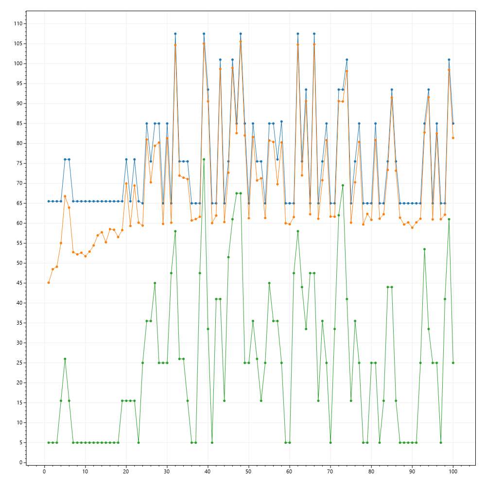
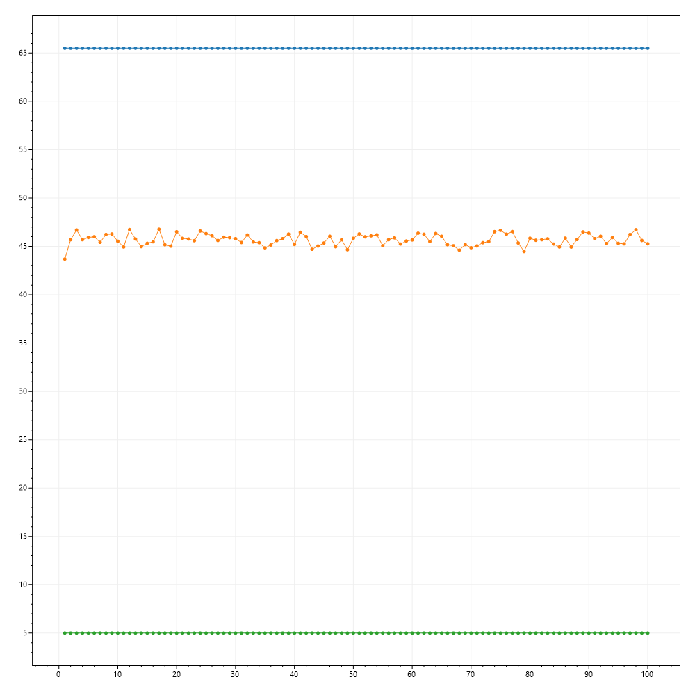

# Treść zadania

Napisać program umożliwiający znalezienie maksimum funkcji dopasowania jednej zmiennej 
określonej dla liczb całkowitych w zadanym zakresie przy pomocy elementarnego algorytmu 
genetycznego (reprodukcja z użyciem nieproporcjonalnej ruletki, krzyżowanie proste, mutacja 
równomierna). Program powinien umożliwiać użycie różnych funkcji dopasowania, populacji o 
różnej liczebności oraz różnych parametrów operacji genetycznych (krzyżowania i mutacji). 
Program powinien zapewnić wizualizację wyników w postaci wykresów  średniego, maksymalnego 
i minimalnego przystosowania dla kolejnych populacji oraz wykresu funkcji w zadanym przedziale. 
 
Program przetestować dla funkcji f(x)= -0.5x 2 +10x+13 dla x= -1, 0, ... 21

# Informacje ogólne

Program Genetic Algorithm implementuje algorytm genetyczny, który umożliwia znalezienie maksimum funkcji dopasowania jednej zmiennej w zadanej dziedzinie liczb całkowitych.

### Genetic Algorithm implementuje takie operacje jak:
- reprodukcja z użyciem nieproporcjonalnej ruletki
- krzyżowanie proste
- mutacja równomierna

### Użytkownik ma wpływ na:
- wzór przekazanej funkcji
- rozmiar populacji
- parametry krzyżowania
- parametry mutacji

### Wynik działania programu jest na bieżąco wizualizowany za pomocą wykresów:
- średniego przystosowania
- maksymalnego przystosowania
- minimalnego przystosowania
- wykresu funkcji w zadanym wcześniej przedziale

## Reprodukcja

1. Na podstwie funkcji przystosowania obliczane jest przystosowanie każdego osobnika. *Prawdopodobieństwo wyboru* danego osobnika do reprodukcji obliczane jest poprzez podzielenie wartości funkcji przystosowania przez sumę wartości funkcji przystosowania wszystkich elementów populacji.
2. Operacja `Select()` implementująca reprodukcję wybiera jeden ciąg kodowy korzystając z mechanizmu opisanego w punkcie `1`.
3. Operacja `Select()` powtarzana jest aż do otrzymania nowej populacji w liczbie równej rozmiarowi poprzedniej symulacji.

## Krzyżowanie

1. Wybrane do krzyżowania osobniki są wynikiem dwukrotnego uruchomienia operacji odpowiedzialnej za reprodukcję.
2. Krzyżowanie jest przeprowadzane z prawdopodobieństwem równym zadanemu prawdopodobieństwu krzyżowania.
3. Dla ciągu kodowego o długości l, w sposób losowy z jednostajnym rozkładem prawdopodobieństwa wybierana jest liczba *i* z zakresu 1-(l - 1), która reprezentuje pierwszy indeks ciągu kodowego, który podlega operacji krzyżowania.
4. Elementy ciągu kodowego z zakresu *i*-(l - 1) zamieniają się pomiędzy sparowanymi ciągami kodowymi.

## Mutacja

1. Operacja jest przeprowadzana na każdym po kolei ciągu kodowym (chromosomie) z populacji.
2. Następuje iteracja po każdym allelu chromosomu.
3. Dla każdego allela operacja mutacji jest przeprowadzana z prawdopodobieństwem równym zadanemu prawdopodobieństwu mutacji.
4. Wartość allela zmieniana jest na przeciwną.

# Instrukcja obsługi

1. Program należy uruchomić z linii komend, bądź za pomocą środowiska Visual Studio.
2. W każdym przypadku należy do programu przekazać listę argumentów. Pełna lista znajduje się poniżej. Wszystkie argumenty są obowiązkowe. Dla niektórych z nich obowiązują ograniczenia.
3. Program na bieżąco będzie informował o błędnych danych, oraz będzie wyświetlał statystyki dla każdego pokolenia.
4. Po zakończeniu działania programu wyniki w postaci wykresów przystosowania i wykresu funkcji można znaleźć w katalogu `results` w katalogu głównym projektu.

```

GeneticAlgorithm:
  App uses genetic algorithm to find maximum of function of one variable defined for integers.

Usage:
  GeneticAlgorithm [options] <pop-size> <mut-prob> <crs-prob> <end-cond> <fit-func> <dom-start> <dom-end>

Arguments:
  <pop-size>     Size of population. Only integer values allowed.
  <mut-prob>     Probability of mutation of single gene. Only values between 0 and 1 allowed.
  <crs-prob>     Probability of crossover of two chromosomes. Only values between 0 and 1 allowed.
  <end-cond>     Number of generations of population without progress (the best adaptation of genome
                 has not risen since end-cond number of generations.
  <fit-func>     Function of fitness of chromosome. Search process is based on this function values.
                 This program supports one variable functions. Variable should be named 'x'.
                 Example of input: f(x)=-0.5*x^2+10x+13
  <dom-start>    Begenning of domain (inclusive) of fitness function. Only integer values.
  <dom-end>      End of domain (inclusive) of fitness function. Only integer values.

Options:
  --version         Show version information
  -?, -h, --help    Show help and usage information

```

### `pop-size`
Liczba osobników populacji. Musi być to liczba parzysta większa od 0.

### `mut-prob`
Prawdopodobieństwo mutacji. Musi być to liczba z zakresu <0, 1> są akceptowane.

### `crs-prob`
Prawdopodobieństwo krzyżowania. Musi być to liczba z zakresu <0, 1> są akceptowane.

### `end-cond`
Liczba pokoleń populacji.

### `fit-func`
Funkcja przystosowania, którą program będzie badał. Funkcja powinna być podana w postaci: `f(x)=wyrażenie`. Przykład: `f(x)=2*x^2`. Pomiędzy kolejnymi elementami wyrażenia powinny się znajdować operatory arytmetyczne. W równaniu nie powinny występować spacje.

### `dom-start`
Początek dziedziny, na której funkcja będzie badana.

### `dom-end`
Koniec dziedziny, na której funkcja będzie badana.

# Testy

Jak widać, w poniższych testach poprawną wartość maksimum dla zadanej funkcji program wyznaczył tylko raz, dla bardzo dużego rozmiaru populacji.

### Test 1

Parametry wywołania: `10 0.05 0.2 100 f(x)=-0.5*x^2+10*x+13 -1 21`



### Test 2

Parametry wywołania: `100 0.01 0.6 100 f(x)=-0.5*x^2+10*x+13 -1 21`


### Test 3

Parametry wywołania: `1000 0.25 0.9 100 f(x)=-0.5*x^2+10*x+13 -1 21`

